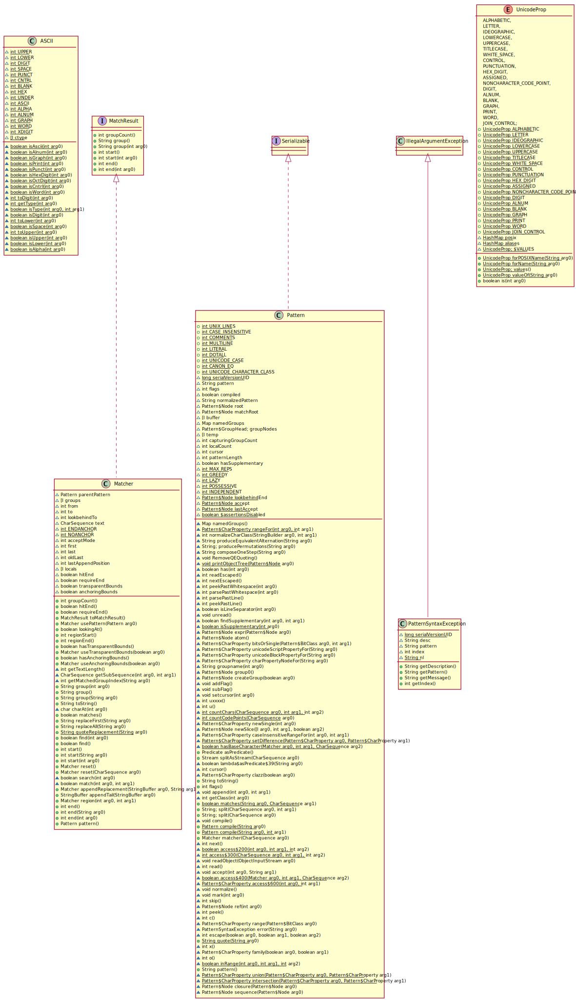

# PlantUmlCodeGenerator

本工具用于扫描指定包下面的所有满足指定条件的类文件生成PlantUml源代码或者渲染出相应的类图图片文件

## 使用第三方依赖：
    1.plantuml
        1）maven依赖
        <!-- https://mvnrepository.com/artifact/net.sourceforge.plantuml/plantuml -->
        <dependency>
            <groupId>net.sourceforge.plantuml</groupId>
            <artifactId>plantuml</artifactId>
            <version>8053</version>
        </dependency>
        2）Java Api调用方式
        参见http://plantuml.com/api
    2.graphviz
        linux：apt-get install graphviz
        windows：http://www.graphviz.org/pub/graphviz/stable/windows/graphviz-2.38.msi

## 接口调用示例代码
```java

public class App {
    public static void main(String[] args) {
        ClassScannerConfiguration classScannerConfiguration = new ClassScannerConfiguration();

        classScannerConfiguration.setRootPackage("java.util.regex");
        classScannerConfiguration.setExcludePackages(new HashSet<>());
        classScannerConfiguration.setIncludePackages(new HashSet<>());
        classScannerConfiguration.setScanSubPackages(true);
        classScannerConfiguration.setScanInnerType(false);

        List<CompilationUnit> compilationUnits = new PlantUmlCodeGenerator(classScannerConfiguration).generate();

        new PrimitivePlantUmlCodeFileWriter("uml.pu", compilationUnits).write();
        new UmlDiagramWriter("uml",UmlDiagramWriter.FILE_TYPE_PNG,compilationUnits).write();
        new UmlDiagramWriter("uml",UmlDiagramWriter.FILE_TYPE_SVG,compilationUnits).write();
    }
}
```

### java.util.regex包类图图片

### 当前项目类图图片
！[当前项目类图图片](images/codegenerator.svg)

***PS：类图图片源码在images目录中***

## SomeThing Maybe Useful
    1.PlantUML类图
        https://yq.aliyun.com/articles/25405
    2.PlantUml with Atom
        http://blog.csdn.net/fwj380891124/article/details/51781804
    3.学习UML实现、泛化、依赖、关联、聚合、组合 
        http://blog.chinaunix.net/uid-26111972-id-3326225.html
    
